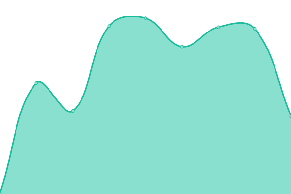

# [📈 Live Status](https://status.nxcore.cloud): <!--live status--> **🟧 Partial outage**

This repository contains the open-source uptime monitor and status page for [Eco](https://play.eco/), powered by [Upptime](https://github.com/upptime/upptime).

With [Upptime](https://upptime.js.org), you can get your own unlimited and free uptime monitor and status page, powered entirely by a GitHub repository. We use [Issues](https://github.com/StrangeLoopGames/EcoServicesMonitor/issues) as incident reports, [Actions](https://github.com/StrangeLoopGames/EcoServicesMonitor/actions) as uptime monitors, and [Pages](https://status.play.eco) for the status page.

<!--start: status pages-->
<!-- This summary is generated by Upptime (https://github.com/upptime/upptime) -->
<!-- Do not edit this manually, your changes will be overwritten -->
<!-- prettier-ignore -->
| URL | Status | History | Response Time | Uptime |
| --- | ------ | ------- | ------------- | ------ |
|  [Accounts Website](https://play.eco) | 🟩 Up | [accounts-website.yml](https://github.com/StrangeLoopGames/EcoServicesMonitor/commits/HEAD/history/accounts-website.yml) | 

 231ms
     
 | 

<a href="https://status.play.eco/history/accounts-website">100.00%</a>
    

|  [Strange Cloud](https://cloud.strangeloopgames.com/health) | 🟩 Up | [strange-cloud.yml](https://github.com/StrangeLoopGames/EcoServicesMonitor/commits/HEAD/history/strange-cloud.yml) | 

 266ms
     
 | 

<a href="https://status.play.eco/history/strange-cloud">100.00%</a>
    

|  [Twitch Integration Services (Release)](https://twitch.play.eco/health) | 🟥 Down | [twitch-integration-services-release.yml](https://github.com/StrangeLoopGames/EcoServicesMonitor/commits/HEAD/history/twitch-integration-services-release.yml) | 

 0ms
     
 | 

<a href="https://status.play.eco/history/twitch-integration-services-release">0.00%</a>
    

<!--end: status pages-->

[**Visit our status website →**](https://status.nxcore.cloud)

## 📄 License

- Powered by: [Upptime](https://github.com/upptime/upptime)
- Code: [MIT](./LICENSE) © [Strange Loop Games](https://strangeloopgames.com)
- Data in the `./history` directory: [Open Database License](https://opendatacommons.org/licenses/odbl/1-0/)
